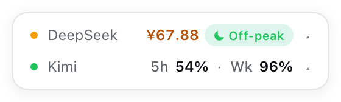
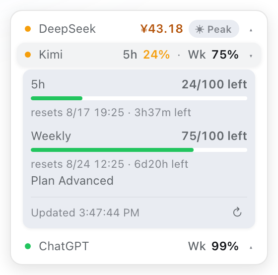

# dsh-quota-status

[](https://www.npmjs.com/package/dsh-quota-status)
[](LICENSE)

> DeepSeek Harness (DSH) web 插件：在一个极简卡片里实时查看 **DeepSeek API 余额**、**Kimi For Coding 套餐余量**（周限 + 5 小时窗口）与 **ChatGPT（Codex）订阅限流窗口**，带剩余量、进度条、重置倒计时和 DeepSeek 波峰/波谷电价提醒。
>
> A DeepSeek Harness (DSH) web plugin: one minimal card for the **DeepSeek API balance**, the **Kimi For Coding plan quota** (weekly + 5h windows) and **ChatGPT (Codex) subscription rate limits** — remaining amounts, progress bars, reset countdowns, and a DeepSeek peak/off-peak pricing reminder.





## 功能 / Features

- 开箱即用：默认读取 `DEEPSEEK_API_KEY` 与 `KIMI_CODING_API_KEY`（经 dsh credentials seam，密钥永不进入浏览器）。
- 极简卡片：固定宽度 260px，每个账户一行（状态点 + 名称 + 数值），展开详情时宽度纹丝不动；行 hover/展开有浅阴影，卡片 hover 抬升阴影。无任何常驻按钮与底栏。
- **余额分档着色**：DeepSeek 余额数值与状态点按金额变色（绿 ≥100 · 黄 20–99 · 红 1–19 · 灰 <1），一眼看出紧张程度。
- **波峰波谷提醒**：DeepSeek 行内嵌「低谷 / 高峰」时段徽标（2026-08-17 起高峰为北京时间每日 09:00–12:00、14:00–18:00，含午间 12:00–14:00 在内的其余时段均为低谷半价；完整时段表在徽标 tooltip 里），展开详情用一句话讲明当前时段与距离切换的倒计时，每秒跟随系统时钟刷新。
- 点击某一行原地展开该账户详情（DeepSeek 充值/赠送拆分 + 峰谷一句话；Kimi 各窗口进度条、剩余量与重置倒计时），再点收起；详情底部有更新时间与手动刷新。
- 可拖动：按住卡片空白处拖到任意位置，位置记忆在浏览器本地。
- 60 秒自动刷新（YAML 可调），页面隐藏时暂停，回到前台立即刷新。
- 中英双语（跟随界面语言），跟随 DSH 设计 token（`--dsw-alias-*`），自动适配深浅主题。
- 仅回环 Connection RPC（`authority: loopback`），API Key 只在宿主进程解析与使用。
- 显示偏好（行、阈值、刷新间隔）全部走 profile YAML 配置，界面保持零设置项。

## 安装 / Install

```bash
dsh plugin --profile web add dsh-quota-status
dsh web
```

> 也可以手动加入 profile：`dsh-quota-status` 是 bundle，会通过 `cordis.patch.yml` 插入 `quota-status` 行。

## 配置 / Configuration

默认无需任何配置。在 `~/.dsh/profiles/web/cordis.patch.yml` 里可以按行覆盖：

```yaml
- id: quota-status
  config:
    refreshMs: 30000          # 默认 60000
    timeoutMs: 15000          # 上游查询超时
    warnBalance: 30           # DeepSeek 余额低于 30 变黄
    criticalBalance: 10       # 低于 10 变红
    warnUsagePercent: 40      # Kimi 余量低于 40% 变黄
    criticalUsagePercent: 15  # 低于 15% 变红
    providers:
      - id: deepseek
        label: DeepSeek
        kind: deepseek-balance
        credential: DEEPSEEK_API_KEY
        endpoint: https://api.deepseek.com/user/balance
      - id: kimi-coding
        label: Kimi Coding
        kind: kimi-usage
        credential: KIMI_CODING_API_KEY
        endpoint: https://api.kimi.com/coding/v1/usages
      # ChatGPT（Codex）订阅（可选，需本地 CLIProxyAPI 网关已登录 codex）：
      # 读网关本地 OAuth 授权文件，查询官方 wham/usage 的 5h/周限窗口。
      - id: codex-sub
        label: Codex
        kind: codex-usage
        credential: ''        # codex-usage 无需 env 凭证
        endpoint: https://chatgpt.com/backend-api/wham/usage
        authDir: ~/.cli-proxy-api   # codex-*.json 所在目录，取最新未禁用文件
```

`providers` 列表会整体替换默认列表；`kind` 支持 `deepseek-balance`、`kimi-usage` 与 `codex-usage`。`codex-usage` 行只在宿主进程读取 CLIProxyAPI 的本地 OAuth 授权文件（`access_token` + `account_id`），token 绝不进入浏览器或任何响应。

## 数据源 / Data sources

| Provider | Endpoint | Meaning |
|---|---|---|
| DeepSeek | `GET https://api.deepseek.com/user/balance` | 可用余额（充值 + 赠送），按量计费，无重置时间 |
| Kimi For Coding | `GET https://api.kimi.com/coding/v1/usages` | 套餐周限（`usage`）+ 各窗口明细（`limits[]`，含 5h 滚动窗口与 `resetTime`） |
| ChatGPT（Codex 订阅） | `GET https://chatgpt.com/backend-api/wham/usage` | 订阅限流窗口（`rate_limit.primary/secondary_window`，按 `limit_window_seconds` 归一化为 5h/周限；`used_percent` 换算剩余量；`plan_type` 显示为套餐等级），凭证来自 CLIProxyAPI 本地 auth 文件 |

## 开发 / Development

```bash
npm install
npm run typecheck
npm test
npm run build          # 输出 lib/（host + client bundle）
```

- `src/providers.ts`：纯函数适配器，fixture 单测在 `tests/providers.spec.ts`。
- `src/index.ts`：host 半身，拥有 `/dsh-quota-status` RPC channel（`specs` / `fetch-all`）。
- `src/client.ts`：浏览器半身，注册 `shell.overlay` 槽位。

## 安全 / Security

- API Key 只通过 `ctx.credentials.resolve()` 在宿主进程解析，不写入响应、日志或浏览器。
- Codex 订阅的 OAuth token 只在宿主进程从 CLIProxyAPI 本地 auth 文件读取（取最新未禁用的 `codex-*.json`），同样不写入响应、日志或浏览器。
- RPC channel 仅回环可访问（`authority: loopback`），浏览器只收到归一化后的余额/余量视图。
- 上游数据可能略有延迟，仅供参考。

## License

MIT
